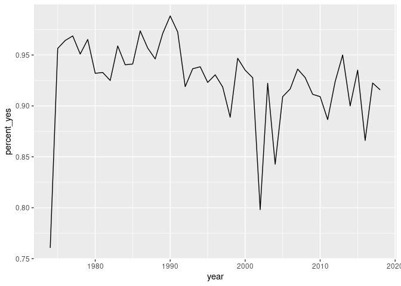
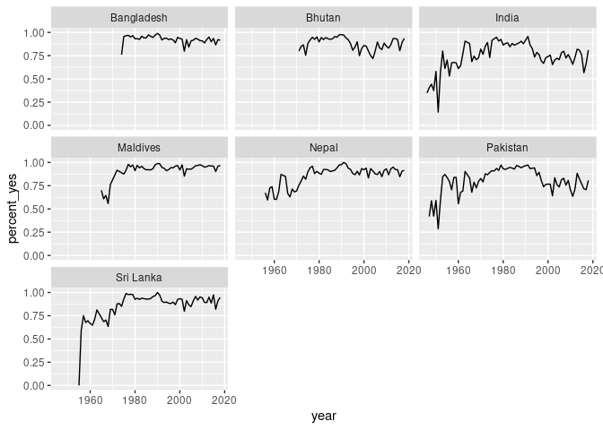
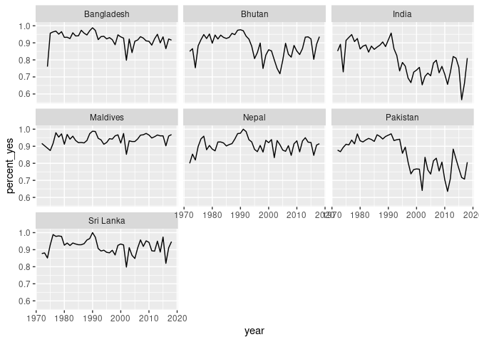
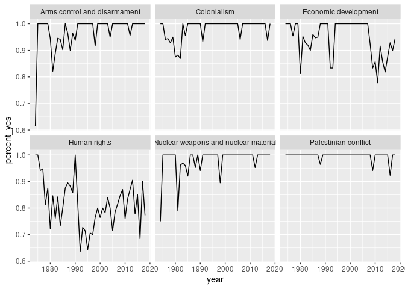
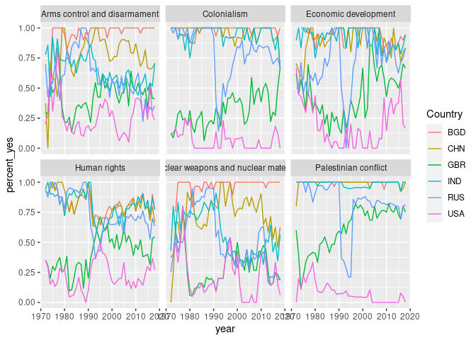

In this exploratory data analysis we will explore the historical voting of the **United Nations General Assembly**, analysis the voting pattern of Bangladesh over time. For this analysis we will use a data set collected from [dataverse](dataverse.harvard.edu)

## Loading the data


**Read data and view data frame structure**


```r
votes <- read.csv("data/UNVotes.csv")
votes <- as_tibble(votes)
str(votes)
```

```
## tibble [1,216,585 × 26] (S3: tbl_df/tbl/data.frame)
##  $ rcid         : int [1:1216585] 3 3 3 3 3 3 3 3 3 3 ...
##  $ ccode        : int [1:1216585] 2 20 31 40 41 42 51 52 53 54 ...
##  $ member       : int [1:1216585] 1 1 NA 1 1 1 NA NA NA NA ...
##  $ vote         : int [1:1216585] 1 3 9 1 1 1 9 9 9 9 ...
##  $ Country      : Factor w/ 390 levels "AFG","AFGHANISTAN",..: 371 61 38 85 153 100 172 351 49 98 ...
##  $ Countryname  : Factor w/ 202 levels "Afghanistan",..: 190 33 12 43 76 52 87 180 15 51 ...
##  $ year         : int [1:1216585] 1946 1946 1946 1946 1946 1946 1946 1946 1946 1946 ...
##  $ session      : int [1:1216585] 1 1 1 1 1 1 1 1 1 1 ...
##  $ abstain      : int [1:1216585] 4 4 4 4 4 4 4 4 4 4 ...
##  $ yes          : int [1:1216585] 29 29 29 29 29 29 29 29 29 29 ...
##  $ no           : int [1:1216585] 18 18 18 18 18 18 18 18 18 18 ...
##  $ importantvote: int [1:1216585] 0 0 0 0 0 0 0 0 0 0 ...
##  $ date         : Factor w/ 864 levels "1946-01-01","1946-01-02",..: 1 1 1 1 1 1 1 1 1 1 ...
##  $ unres        : Factor w/ 5704 levels "","A/RES/71/102",..: 338 338 338 338 338 338 338 338 338 338 ...
##  $ amend        : int [1:1216585] 1 1 1 1 1 1 1 1 1 1 ...
##  $ para         : int [1:1216585] 0 0 0 0 0 0 0 0 0 0 ...
##  $ short        : Factor w/ 2022 levels "","?áINTERNATIONAL TRADE",..: 83 83 83 83 83 83 83 83 83 83 ...
##  $ descr        : Factor w/ 4558 levels "","0","10th anniversary of the adoption of the Declaration on the Preparation of Societies for Life in Peace",..: 2299 2299 2299 2299 2299 2299 2299 2299 2299 2299 ...
##  $ me           : int [1:1216585] 0 0 0 0 0 0 0 0 0 0 ...
##  $ nu           : int [1:1216585] 0 0 0 0 0 0 0 0 0 0 ...
##  $ di           : int [1:1216585] 0 0 0 0 0 0 0 0 0 0 ...
##  $ hr           : int [1:1216585] 0 0 0 0 0 0 0 0 0 0 ...
##  $ co           : int [1:1216585] 0 0 0 0 0 0 0 0 0 0 ...
##  $ ec           : int [1:1216585] 0 0 0 0 0 0 0 0 0 0 ...
##  $ ident        : int [1:1216585] 0 0 0 0 0 0 0 0 0 0 ...
##  $ resid        : int [1:1216585] 1001 1001 1001 1001 1001 1001 1001 1001 1001 1001 ...
```

The vote column of the votes dataset represent the vote of a country for a particular issue. The number indicates as:

- 1 = Yes
- 2 = Abstain
- 3 = No
- 8 = Not present
- 9 = Not a member

In our analysis we will just consider first 3 type of votes, Yes, Abstain & No. So in below step we will filter out the unnecessary data.


```r
votes <- votes %>%
  filter(vote <= 3)
```

## Summarizing Votes
Now, we will summarize the votes cast by Bangladesh and plot a time series using the data to visualize the voting cast by Bangladesh.


```r
votes_processed_bangladesh <- votes %>%
  filter(Countryname == "Bangladesh") %>%
  group_by(year) %>%
  summarize(total = n(), percent_yes = mean(vote == 1))

ggplot(votes_processed_bangladesh, aes(x = year, y = percent_yes)) + geom_line()
```

<!-- -->

From the line plot we can easily say that most of the time **Yes** vote casting by Bangladesh over **85%**.

Lets do some comparison with the South Asian countries.


```r
votes_processed <- votes %>%
  filter(Countryname %in% countries_1) %>%
  group_by(Countryname, year) %>%
  summarize(total = n(), percent_yes = mean(vote == 1))

ggplot(votes_processed, aes(x = year, y = percent_yes)) + geom_line() + facet_wrap(~ Countryname)
```

<!-- -->

From this comparison we can easily see that Bangladesh, Bhutan & Maldives have some similarities. Lets apply one more filter, since Bangladesh born in 1971, we will consider the vote after 1971.


```r
votes_processed <- votes %>%
  filter(Countryname %in% countries_1, year >= 1972) %>%
  group_by(Countryname, year) %>%
  summarize(total = n(), percent_yes = mean(vote == 1))

ggplot(votes_processed, aes(x = year, y = percent_yes)) + geom_line() + facet_wrap(~ Countryname)
```

<!-- -->

In this time period (1972-2020), we can see that Bangladesh, Maldives, Nepal & Sri Lanka cast positive vote in between 80%-100%. They are also consistent for casting positive vote.

## Tidying data

In this section we will use some R package to make our data tidy. After that we will perform analysis on tidied data. We do not need all 26 columns in our analysis so lets first remove unnecessary columns from the data frame.


```r
votes_tidied <- votes %>%
  select(rcid:session, unres,me:ec)
```

There are 6 columns in the dataset that describe the topic of a resolution,

- **me**: Palestinian conflict
- **nu**: Nuclear weapons and nuclear material
- **di**: Arms control and disarmament
- **hr**: Human rights
- **co**: Colonialism
- **ec**: Economic development

Now, we will transform the data so that each row has one combination of country-vote-topic so that we can analyze the graph by topic.


```r
votes_tidied <- votes_tidied %>%
  gather(topic, has_topic, me:ec) %>%
  filter(has_topic == 1)

head(votes_tidied)
```

```
## # A tibble: 6 x 11
##    rcid ccode member  vote Country Countryname  year session unres topic
##   <int> <int>  <int> <int> <fct>   <fct>       <int>   <int> <fct> <chr>
## 1    77     2      1     1 USA     United Sta…  1947       2 R/2/… me   
## 2    77    20      1     1 CAN     Canada       1947       2 R/2/… me   
## 3    77    40      1     3 CUB     Cuba         1947       2 R/2/… me   
## 4    77    41      1     1 HTI     Haiti        1947       2 R/2/… me   
## 5    77    42      1     1 DOM     Dominican …  1947       2 R/2/… me   
## 6    77    70      1     2 MEX     Mexico       1947       2 R/2/… me   
## # … with 1 more variable: has_topic <int>
```

It is difficult to interpret me, nu etc.. Lets re-code this abbreviation with the actual name.


```r
votes_tidied <- votes_tidied %>%
  mutate(topic = recode(topic,
                        me = "Palestinian conflict",
                        nu = "Nuclear weapons and nuclear material",
                        di = "Arms control and disarmament",
                        hr = "Human rights",
                        co = "Colonialism",
                        ec = "Economic development"))

by_country_year_topic <- votes_tidied %>%
  group_by(Countryname, year, topic) %>%
  summarize(total = n(), percent_yes = mean(vote == 1)) %>%
  ungroup()

head(by_country_year_topic)
```

```
## # A tibble: 6 x 5
##   Countryname  year topic                total percent_yes
##   <fct>       <int> <chr>                <int>       <dbl>
## 1 Afghanistan  1946 Colonialism              5       0.2  
## 2 Afghanistan  1946 Economic development     6       0.333
## 3 Afghanistan  1946 Human rights             1       0    
## 4 Afghanistan  1947 Colonialism              8       0.5  
## 5 Afghanistan  1947 Economic development     2       0.5  
## 6 Afghanistan  1947 Palestinian conflict     7       0.143
```

Lets analyze topic wise vote for Bangladesh.


```r
bd_by_country_year_topic <- by_country_year_topic %>%
  filter(Countryname == "Bangladesh")

ggplot(bd_by_country_year_topic, aes(x = year, y = percent_yes)) + geom_line() + 
  facet_wrap(~ topic)
```

<!-- -->

From the above plot it seems, Human rights Bangladesh's votes has changes significantly over time. 


## Modeling

Now, we will apply statistical modeling and quantify the trends across the countries and interpret them together. First we will fit the linear regression model for the percentage of YES votes from Bangladesh.


```r
BD_by_year <- votes_tidied %>%
  group_by(Countryname, year) %>%
  summarize(total = n(), percent_yes = mean(vote == 1)) %>%
  filter(Countryname == "Bangladesh")
BD_fit <- lm(percent_yes ~ year, data = BD_by_year)
summary(BD_fit)
```

```
## 
## Call:
## lm(formula = percent_yes ~ year, data = BD_by_year)
## 
## Residuals:
##       Min        1Q    Median        3Q       Max 
## -0.063325 -0.010678 -0.000769  0.011942  0.052661 
## 
## Coefficients:
##               Estimate Std. Error t value Pr(>|t|)  
## (Intercept)  1.034e+00  5.228e-01   1.977   0.0545 .
## year        -4.368e-05  2.619e-04  -0.167   0.8683  
## ---
## Signif. codes:  0 '***' 0.001 '**' 0.01 '*' 0.05 '.' 0.1 ' ' 1
## 
## Residual standard error: 0.02282 on 43 degrees of freedom
## Multiple R-squared:  0.0006464,	Adjusted R-squared:  -0.02259 
## F-statistic: 0.02781 on 1 and 43 DF,  p-value: 0.8683
```

From the applied linear model we can see that, the estimated change each year of the probability of the Bangladesh voting "yes" is -0.00004368. Which is not so much significant. We also observe that from the p-value which is 0.8683 in this case (p-value below 0.05 are significant)

Now we will fit this model for each topic and check that if there is any particular topic which has significant changes over time.


```r
BD_by_year_by_topic <- votes_tidied %>%
  group_by(Countryname, year, topic) %>%
  summarize(total = n(), percent_yes = mean(vote == 1)) %>%
  filter(Countryname == "Bangladesh")

Bangladesh_topics_coefficients <- BD_by_year_by_topic %>%
  nest(-topic) %>%
  mutate(model = map(data, ~ lm(percent_yes ~ year, data = .)), tidied = map(model, tidy)) %>%
  unnest(tidied)
```

```
## Warning: All elements of `...` must be named.
## Did you want `data = c(Countryname, year, total, percent_yes)`?
```

```r
Bangladesh_topics_coefficients %>%
  filter(term == "year") %>%
  mutate(p.adjusted = p.adjust(p.value)) %>%
  filter(p.adjusted < 0.05)
```

```
## # A tibble: 2 x 9
##   topic      data    model term  estimate std.error statistic p.value p.adjusted
##   <chr>      <list>  <lis> <chr>    <dbl>     <dbl>     <dbl>   <dbl>      <dbl>
## 1 Arms cont… <tibbl… <lm>  year   0.00218  0.000705      3.09 0.00348     0.0209
## 2 Coloniali… <tibbl… <lm>  year   0.00117  0.000384      3.06 0.00384     0.0209
```

From the above analysis we can see that, over the time Bangladesh's voting pattern significantly change for two topics **Arms control and disarmament & Colonialism**. 

Finally in the last analysis we will compare the voting with some developed countries and try to visualize, is there any similarities between them.  


```r
knitr::opts_chunk$set(fig.height = 9, fig.width = 7)
votes_by_topic_by_country <- votes %>%
  select(rcid:session, unres,me:ec) %>%
  filter(Countryname %in% countries_2, year >= 1972) %>%
  gather(topic, has_topic, me:ec) %>%
  filter(has_topic == 1) %>%
  mutate(topic = recode(topic,
                        me = "Palestinian conflict",
                        nu = "Nuclear weapons and nuclear material",
                        di = "Arms control and disarmament",
                        hr = "Human rights",
                        co = "Colonialism",
                        ec = "Economic development")) %>%
  group_by(Countryname, Country, year, topic) %>%
  summarize(total = n(), percent_yes = mean(vote == 1)) %>%
  ungroup()

ggplot(votes_by_topic_by_country, aes(x = year, y = percent_yes, color=Country)) + geom_line() + facet_wrap(~ topic)
```



From the above analysis we can see that, for some topic, like **Human rights, Colonialism & Economic development**, there is a little bit similarities in voting between Bangladesh, India & China but other topics there is no similarities.

## Next
So we can carry out our analysis further and try to answer the following questions

1. For Bangladesh, is voting pattern has similarities when different political party is in power?
2. Which countries has similar voting pattern?
3. Can we identify similar interest between different countries by analysis the voting similarities?
4. Which country have significant changes in voting?

## References
1. [Data Source](https://dataverse.harvard.edu/file.xhtml?persistentId=doi:10.7910/DVN/LEJUQZ/HAPPV6&version=27.0)
2. [Datacamp Course](https://learn.datacamp.com/courses/case-study-exploratory-data-analysis-in-r)


